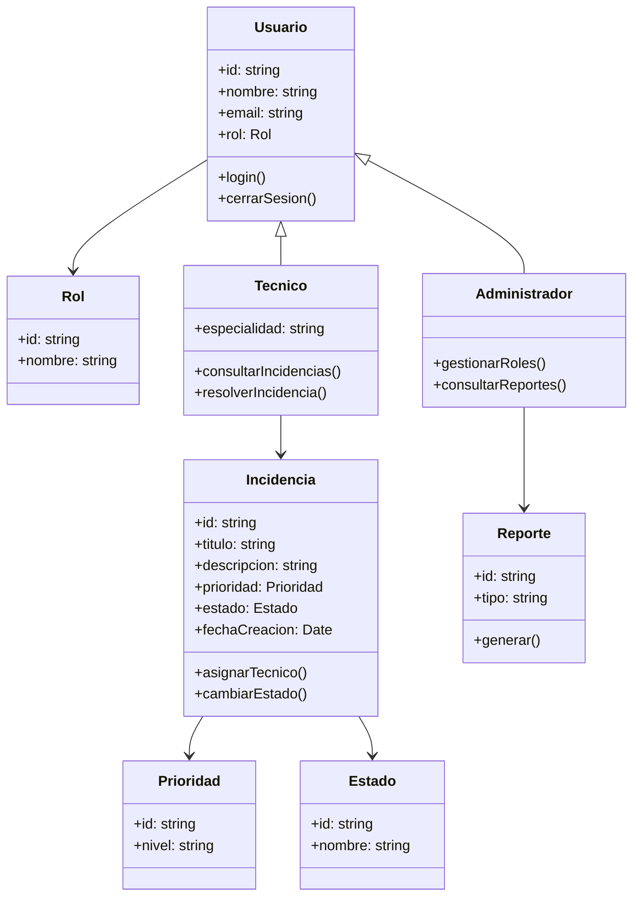

# Diseño de clases

## Visión arquitectónica
La solución se organiza en capas para separar la lógica de negocio, la persistencia y la presentación. La capa de dominio centraliza las reglas del flujo de incidencias, mientras que la capa de infraestructura gestionará acceso a bases de datos y servicios externos.

## Diagrama de clases

## Principios aplicados
- Encapsulamiento: las entidades de negocio no exponen internamente su estado completo.
- Bajo acoplamiento: las capas se comunican mediante interfaces y servicios.
- Reutilización: los reportes y validadores se implementan como componentes compartidos.
- Extensibilidad: se pueden añadir nuevos tipos de incidencias sin mover la base del sistema.

## Decisiones relevantes
Se utiliza un modelo de dominio común para todos los módulos, combinado con servicios de aplicación para coordinar operaciones complejas. Esto simplifica la validación de reglas y mejora la mantenibilidad del código.